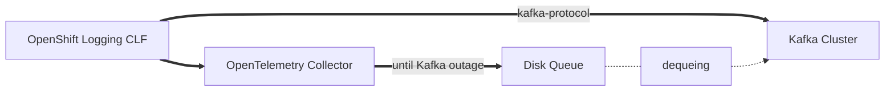
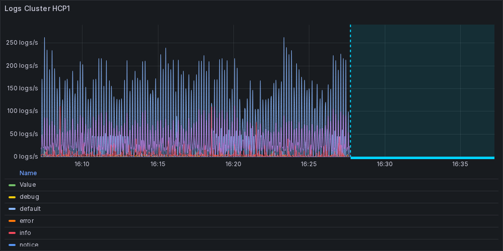
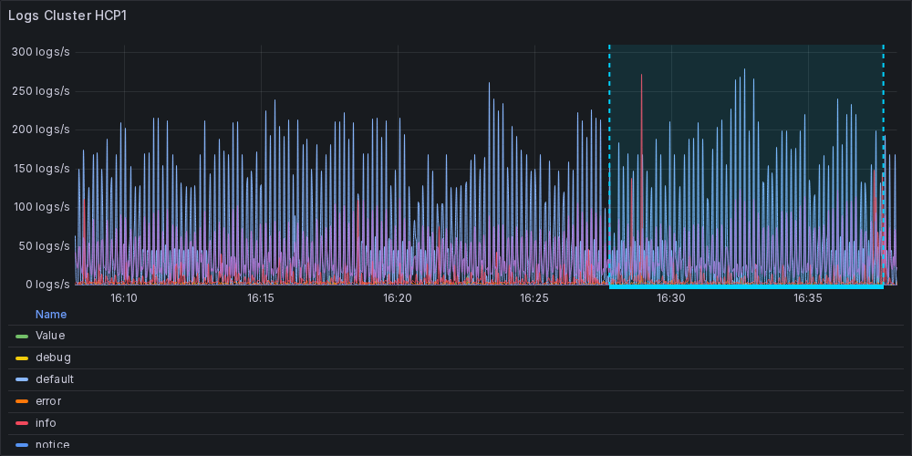

# OpenShift Logging with OTEL disk buffer to cover Vector output outage

Don't get it wrong, OpenShift Logging and in particular Cluster Log Forwarder (CLF) are great. Unfortunately at the moment we lack to buffer to disk for a longer period of time. This is an issue in particular in large deployments as depending on the volume you might face that you'll have only a few minutes to recover your output sink from an outage.

The following concept will show how we can mitigate the situation by adding another output sink that will enqueue to disk and only dequeue after manual intervention to refill the missed logs during an outage.

**!!! NOTE !!!** the following deployment is not supported by Red Hat in anyway and based upon Technology Preview (TP) components. **DO NOT USE IT IN PRODUCTION**

## Concept 
The concept behind the idea is to have a secondary output that will only be used in case of an outage. The main player is still CLF with your primary output sink.

The OpenTelemetyCollector (OTC) will be used to extend the functionality of disk based buffering for Vector.



## Setup the Proof Of Concept (POC)

Since the POC is based upon OpenShift Logging 6.2 the minimum version of the OpenShift Cluster (OCP) needs to be 4.16+ 
Further, since we are not using a GitOps controller for the POC, creating the resources might not succeed due to the race-condition of CRD's and or Operators not available at CR injection time. In case not all resources are created, re-execute the `apply` commands.

* ensure to adjust the `storageClassName` in the file `otc/otel-collector.yml` to any matching storageclass available in your Cluster
* to retrieve a full list of storageclasses available execute following command
    ```
    oc get storageclass
    ```
* ensure to adjust the `otlphttp/loki` endpoint in the file `otc/otel-collector.yml` to match the Log Store you have available. 

### Clusters without OpenShift Logging or Red Hat Build of OpenTelemetry installed

If you do not have OpenShift Logging and Red Hat Build of OpenTelemetry installed so far you can get the complete stack  installed by executing following command

```
oc apply -k .
```

### Clusters with OpenShift Logging 6.2+ installed 

* Install the Red Hat Build of OpenTelemetry by executing following command
    ```
    oc apply -k otc
    ```
* With OpenShift Logging installed you need to add a new output sink to your CLF configuration
	```
	- name: otlp
	  otlp:
	    tuning:
	      deliveryMode: AtLeastOnce
	      maxRetryDuration: 20
	      minRetryDuration: 5
	    url: http://otel-collector.openshift-logging.svc.cluster.local:4318/v1/logs
	  type: otlp
	```

The configuration of the POC assumes we are installing the OTEL collector into the `openshift-logging` namespace which drafts the `url` the output is connecting to.

## Verification

To verify the setup with `queuing` we simulate an outage to the primary output sink. In the screenshots we'll see the Annotation of the outage which will last for 10 minutes (blue area). During that outage, no Logs are expected to be seen in the Log Store. 


After resolving the outage, CLF might not be able to deliver all messages from it's disk bugger. The OTEL collector will fill the gaps as seen with no outage on the Logs volume query.

